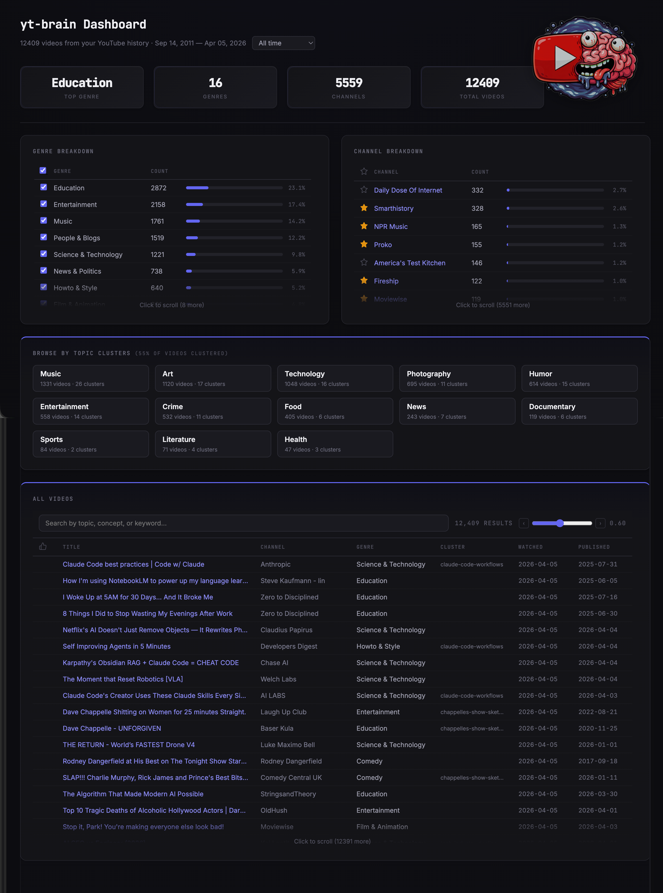

# yt-brain

Turn passive YouTube watching into active knowledge.

yt-brain ingests your YouTube watch history, classifies videos by genre and channel, and provides an interactive dashboard to explore your viewing patterns. Built as a foundation for semantic clustering, NotebookLM export, and Obsidian integration.



## Quick Start

```bash
# Import watch history from Google Takeout (zip or directory)
yt-brain ingest takeout ~/Downloads/takeout-*.zip

# Backfill metadata (channel names, categories, dates, descriptions)
yt-brain backfill-channels
yt-brain backfill-categories
yt-brain backfill-dates
yt-brain backfill-descriptions

# Generate semantic embeddings for search
yt-brain embed

# Launch the interactive dashboard
yt-brain dashboard

# Keep data current (fetches new videos from YouTube history)
yt-brain sync
```

## Commands

| Command | Description |
|---------|-------------|
| `ingest takeout <path>` | Import from Google Takeout (zip or directory) |
| `ingest video <url>` | Add a single video by URL |
| `history [-n 50] [--save]` | Browse recent watch history via yt-dlp |
| `fetch <period>` | Fetch history for a time period (e.g. `1yr`, `2yr`) |
| `sync [--browser chrome]` | Fetch and add new videos since last sync |
| `classify [--reclassify]` | Run engagement classification |
| `review [--level <tier>]` | Interactive review by engagement tier |
| `status` | Show video counts by engagement tier |
| `transcript <video_id>` | Fetch transcript via yt-dlp |
| `backfill-channels` | Fill missing channel names via oEmbed |
| `backfill-dates` | Fill missing dates via YouTube Data API |
| `backfill-categories` | Fill missing categories via YouTube Data API |
| `backfill-descriptions` | Fill missing descriptions via YouTube Data API |
| `embed [--rebuild]` | Generate semantic embeddings for search |
| `dashboard [--port 5555]` | Launch web dashboard |
| `config` | Show current configuration |

## Dashboard

The web dashboard provides:

- **Genre Breakdown** with checkboxes to filter by genre
- **Channel Breakdown** with clickable links to YouTube
- **Semantic Search** — find videos by topic or concept, not just exact words
- **Time filter** dropdown (1 day, 1 week, 1 month, 6 months, 1-5 years, all)
- **Date range** display based on actual watch dates

All filters combine — search by topic, select a year range, check specific genres, and filter by starred channels simultaneously.

### Search Syntax

| Query | Behavior |
|-------|----------|
| `machine learning` | Semantic search — finds related videos by meaning |
| `"kubernetes"` | Semantic + exact match on "kubernetes" in title or description |
| `title:"Claude"` | Exact match in title only (case-insensitive) |
| `desc:"tutorial"` | Exact match in description only |
| `channel:"3Blue1Brown"` | Exact match in channel name |
| `AI agents title:"python"` | Semantic search for "AI agents", filtered to titles containing "python" |

Filters are combinable: `machine learning title:"python" channel:"sentdex"`

## Data Sources

| Source | What it provides |
|--------|-----------------|
| **Google Takeout** | Watch history with timestamps, channel names |
| **YouTube Data API** | Video upload dates (via `backfill-dates`) |
| **YouTube oEmbed** | Channel names (via `backfill-channels`) |
| **yt-dlp** | Recent history, video metadata, transcripts |
| **sentence-transformers** | Local semantic embeddings (all-MiniLM-L6-v2) |
| **sqlite-vec** | Vector search for semantic similarity |

## Setup

### Prerequisites

- **Python 3.12+**
- **uv** ([install guide](https://docs.astral.sh/uv/getting-started/installation/))
- **yt-dlp** (for `sync`, `history`, and `transcript` commands)
  - Install: `uv tool install yt-dlp` or `brew install yt-dlp`
  - Must be logged into YouTube in your browser for `sync` and `history`

### Install

```bash
git clone https://github.com/jayers99/yt-brain.git
cd yt-brain
uv sync
```

To enable AI-powered cluster naming (optional):

```bash
uv sync --extra ai
```

Alternatively, install with pip into any existing environment:

```bash
pip install .
```

### Makefile

A `Makefile` is included for common dev tasks:

| Target | Command |
|--------|---------|
| `make install` | `uv sync` — install core dependencies |
| `make dev` | `uv sync --dev --extra ai` — install all dev + optional deps |
| `make test` | `uv run pytest -v` |
| `make lint` | `uv run ruff check src/ tests/` |
| `make typecheck` | `uv run mypy` |
| `make run` | `uv run yt-brain dashboard` |
| `make clean` | Remove `__pycache__`, caches, build artifacts |

Run `make` with no arguments to see available targets.

### Google Takeout (recommended starting point)

1. Go to [takeout.google.com](https://takeout.google.com)
2. Deselect all, then select only **YouTube and YouTube Music** > **history**
3. Choose JSON format (not HTML)
4. Export and download the zip
5. Run: `yt-brain ingest takeout ~/Downloads/takeout-*.zip`

### API Keys (optional)

API keys enable additional features. Set them via environment variables or config file.

**YouTube Data API Key** — needed for `backfill-dates`, `backfill-categories`, `backfill-descriptions`, `fetch`, and `sync`:

1. Create a project in [Google Cloud Console](https://console.cloud.google.com)
2. Enable **YouTube Data API v3**
3. Create an API key under **Credentials**
4. Set it:
   ```bash
   # Option 1: Environment variable
   export YOUTUBE_API_KEY="your-key-here"

   # Option 2: Config file (~/.config/yt-brain/config.yaml)
   yt-brain config  # then add youtube_api_key: your-key-here
   ```

**Anthropic API Key** — needed for AI-powered cluster naming (optional, falls back to numeric names):

```bash
# Option 1: Environment variable
export ANTHROPIC_API_KEY="your-key-here"

# Option 2: Config file
# Add to ~/.config/yt-brain/config.yaml:
# anthropic_api_key: your-key-here
```

### Browser Cookies (for sync/history)

The `sync` and `history` commands use yt-dlp to read your browser's YouTube cookies. You must be logged into YouTube in your browser. By default, Chrome is used:

```bash
yt-brain sync                  # uses Chrome
yt-brain sync --browser firefox  # use Firefox instead
```

Supported browsers: chrome, firefox, edge, safari, opera, brave.

> **Note:** Cookie access may require granting terminal/yt-dlp access in your OS security settings (macOS: System Settings > Privacy & Security > Full Disk Access).

## Architecture

Hexagonal architecture with swappable infrastructure adapters:

```
src/yt_brain/
├── cli.py                  # Typer CLI entry point
├── domain/                 # Pure models, classification logic
├── application/            # Service orchestration
├── infrastructure/         # SQLite, YouTube API, Takeout parser, yt-dlp
└── web/                    # Flask dashboard, genre classifier
```

Data stored in SQLite at `~/.config/yt-brain/yt-brain.db`.

## Troubleshooting

### sqlite-vec installation issues

sqlite-vec is a native SQLite extension used for semantic search and clustering. **It is optional** -- all other features (ingest, classify, review, dashboard, etc.) work without it. If sqlite-vec fails to install or load:

- **macOS (Apple Silicon)**: Usually works out of the box with `uv sync`. If not, try `brew install sqlite` first.
- **macOS (Intel)**: `brew install sqlite && uv sync`
- **Linux (x86_64)**: Ensure `libsqlite3-dev` is installed (`apt install libsqlite3-dev`), then `uv sync`
- **Linux (ARM/other)**: Pre-built wheels may not be available. Install from source: `pip install sqlite-vec --no-binary sqlite-vec`
- **Windows**: Pre-built wheels are available for x86_64. If installation fails, try `pip install sqlite-vec --no-binary sqlite-vec`

When sqlite-vec is unavailable:
- `yt-brain embed` and `yt-brain cluster` will print a clear error message
- Dashboard search falls back to text-based (LIKE) queries instead of semantic search
- All other commands work normally

### "Could not extract cookies" / sync fails

- Ensure you're logged into YouTube in your browser
- macOS: grant Full Disk Access to your terminal app (System Settings > Privacy & Security)
- Try a different browser: `yt-brain sync --browser firefox`

### "Missing youtube_api_key"

Set your API key via environment variable or config file. See [API Keys](#api-keys-optional) above.

### "Not enough videos to cluster"

You need at least 10 videos with embeddings. Run `yt-brain embed` first, then `yt-brain cluster --rebuild`.

### Config location

All data is stored in `~/.config/yt-brain/`:
- `config.yaml` — API keys, thresholds
- `yt-brain.db` — SQLite database with all video data

Override with: `export YT_BRAIN_CONFIG_DIR=/path/to/dir`

## Contributing

See [CONTRIBUTING.md](CONTRIBUTING.md) for development setup and guidelines.

## License

MIT
